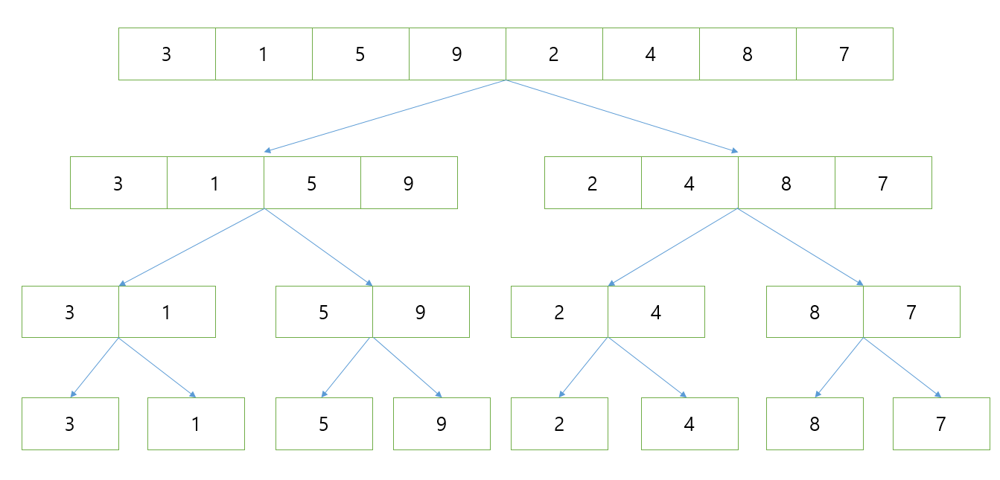
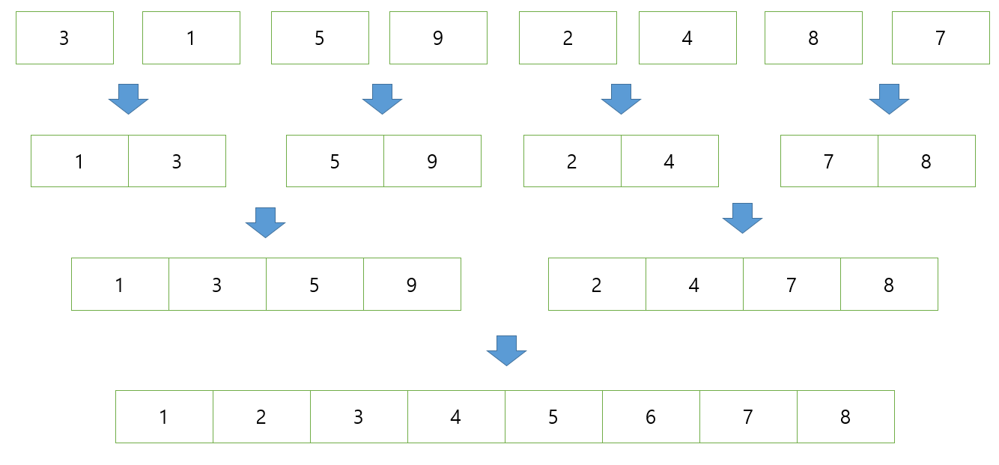
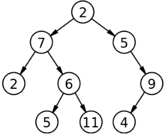
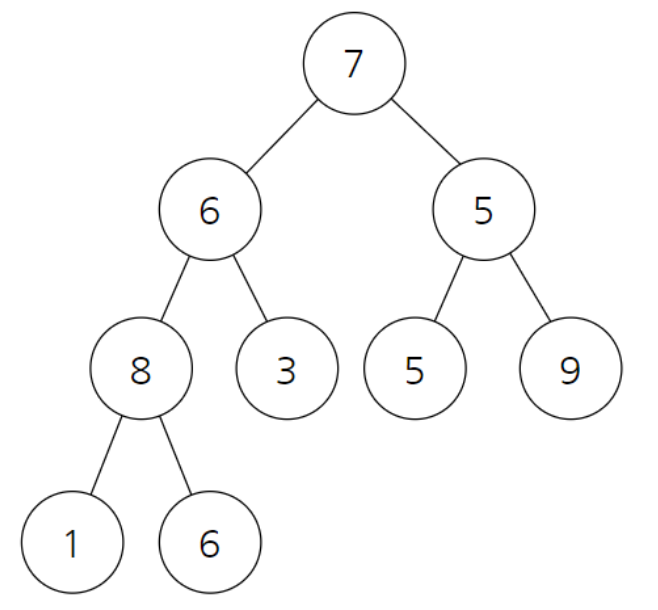

  2019년 10월 5일

  # 병합 정렬 (Merge Sort)

  -	평균 속도 : O(N*logN)
  - `분할 정복 방법`을 사용한 알고리즘
  - `풀이 방식` :주어진 문제를 반으로 나눠 각자 계산하여 정렬한 후에 나중에 합친다.
  - 퀵 정렬은 이미 정렬이 되어있는 경우 `최악시간복잡도`인 **O(n^2)** 가 나오는 반면 병합 정렬은 반을 나누고 나서 나중에 합치는 형식이므로 **최악의 경우에도 O(N*logN)** 이 보장된다.

## 과정

### 1. 분할 과정
- 따로 피벗을 정하지 않고 정확히 반으로 계속해 쪼개나간다.
- 크기가 1이었던 배열이 2^3 인 8이 된다. **즉, 3단계만 거치면 분할과정이 끝이나게 된다.**
`이를 통해 단계의 크기는 logN 임을 알 수 있다.`



### 2. 병합 과정
- 쪼개졌던 것들을 합치는 순간 정렬을 수행한다.
- 정렬이 필요한 수행시간은 배열의 크기인 N이므로 `분할 수행시간 logN`과 `정렬 수행시간 N` 이 곱해져 시간복잡도는 **O(N*logN)** 이 된다.



```c++
#include <stdio.h>

int number = 8;
int sorted[8]; // 배열은 반드시 전역변수로


void merge(int a[], int m, int middle, int n){
	// m = 시작점, middle = 중간점 , n = 끝점
	int i=m;
	int j = middle + 1;
	int k = m;
	//작은 순서대로 배열에 삽입
	while( i <= middle && j<=n){
		if (a[i] <= a[j]){
			sorted[k]= a[i];
			i++;
		}else{
			sorted[k] = a[j];
			j++;
		}
		k++;
	}

	if(i > middle){
		for (int t = j; t <= n; t++){
			sorted[k] = a[t];
			k++;
		}
	}else{
		for (int t = i; t <= middle; t++){
			sorted[k] = a[t];
			k++;
		}
	}

	//정렬된 배열 삽입
	for ( int t = m; t <= n; t++){
		a[t] = sorted[t];
	}
}

void mergeSort(int a[], int m, int n){
	if (m<n){
		int middle = (m+n) / 2;
		mergeSort(a,m, middle);
		mergeSort(a, middle+1 , n);
		merge(a, m, middle, n);
	}
}

int main(void) {
	int array[number] = {3, 1, 5, 9, 2, 4, 8, 7};
	mergeSort(array, 0, number - 1);
	for (int i =0; i< number; i++){
		printf("%d ", array[i]);
	}
}
```


- `코드를 짤 때 주의할 점` : 반드시 정렬에 사용되는 배열은 전역변수로 선언해주어야 한다. 함수 안에서 배열을 선언해 준다면 필요할 때마다 계속 선언을 해주어야 하므로 **메모리 낭비가 생길 수 있기 때문이다.**

---
2019-10-29

# 힙 정렬 (Heap sort)
힙 정렬을 알기 위해선 먼저 이진트리와 완전 이진트리에 대해 알아야 한다.

- `이진트리` : 다음의 그림과 같이 모든 노드의 자식 노드가 2개 이하인 노드를 말한다.


- `완전이진트리` : 데이터가 루트 노드부터 시작해서 자식 노드는 왼쪽부터 오른쪽으로 차근차근 들어가는 구조의 이진트리를 말한다.

---
힙 소트 알고리즘은 이러한 `완전이진트리` 형태에서 **자신보다 자식 노드의 값이 더 크다면 위치를 바꾸는 알고리즘** 이다. 자신보다 더 큰 자식이 나타나지 않을 때까지 수행하게 된다.

- 트리구조는 한 번 자식 노드로 내려갈때마다 노드의 갯수가 2배 증가하므로 O(logN)의 시간복잡도를 가지고 이러한 과정을 N번 수행해야 하므로 힙 정렬의 시간복잡도는 O(NlogN)이 된다.
## 과정
1. 전체 트리를 힙구조로 만들어준 후 **가장 최상단 노드와 맨 마지막 노드를 바꾸어 준다.**
2. 힙 트리의 **크기를 1 빼준 후** 다시 힙 구조로 만들어 준다.
3. 이 과정을 반복하다 보면 오름차순으로 정렬된 트리를 만들 수 있다.

```C++
#include <iostream>
using namespace std;

int main(){
	int heap[10] = {3,4,2,5,1,6,8,7,9};
	int number = 10;

	//전체 트리구조를 힙구조로 바꾼다.
	for(int i=1; i<number; i++){
		int c = i; //자신 노드의 인덱스

		while(c!=0){
			int root = (c-1) / 2; // 부모 노드의 인덱스

			if(heap[root] < heap[c]){
				int temp = heap[root];
				heap[root] = heap[c];
				heap[c] = temp;
			}
			c = root;
		}
	}

	//크기를 줄여가며 반복적 힙을 구성
	for(int i=number-1; i>=0; i--){
		int temp = heap[0];
		heap[0] = heap[i];
		heap[i] = temp;

		int root = 0; //루트 노드의 인덱스
		int c = 1;

		while(c<i){
			c = 2*root + 1;//자식노드 인덱스

			//자식 중에 더 큰 값 찾기
			if(heap[c] < heap[c+1] && c<i-1){
				c++;
			}

			//루트보다 자식이 더 크다면 교환
			if(heap[root] < heap[c] && c<i) {
				int temp = heap[root];
				heap[root] = heap[c];
				heap[c] = temp;
			}

			root = c;
		}
	}

	for (int i =0; i<number; i++){
		cout << heap[i] << ' ';
	}

	return 0;
}
```

---
2019-11-05
# 계수 정렬(Counting Sort)

- ` 크기를 기준`으로 정렬
- `'범위조건'` 이 있는 경우에 한해 매우 빠른 알고리즘
- 범위조건이 있다면 `시간복잡도 O(N)`을 가짐


```C++
#include <stdio.h>

int main(void){
	int temp;
	int count[5];
	int array[30] = {
	1, 3, 2, 4, 3, 2 ,5, 3, 1, 2,
	3, 4, 4, 3, 5, 1, 2, 3, 5, 2,
	3, 1, 4, 3, 5, 1, 2, 1, 1, 1};

	for (int i=0; i<5; i++){ // 1~5까지이므로 count 를 모두 0으로 초기화해준다.
		count[i] = 0;
	}
	for(int i=0; i<30; i++){ // 배열에서 중복되는 숫자의 갯수를 세어준다.
		count[array[i]- 1]++;
	}
	for(int i =0; i<5; i++){ // 1부터5까지 자연스럽게 정렬이 된 상태로 출력이 된다.
		if(count[i] != 0){
			for(int j=0; j<count[i]; j++){
				printf("%d", i+1);
			}
		}
	}
	return 0;
}
```

- 배열의 숫자들이 나타난 횟수를 저장해준다.
`1` : 8번
`2` : 6번
`3` : 8번
`4` : 4번
`5` : 4번
- 다음 범위만큼 count 배열을 출력해주기만 하면 정렬이 완성된 것을 알 수 있다.
- **범위만 안다면** 모든 데이터에 한 번만 접근하면 되기 때문에 매우 효율적인 알고리즘이다.
