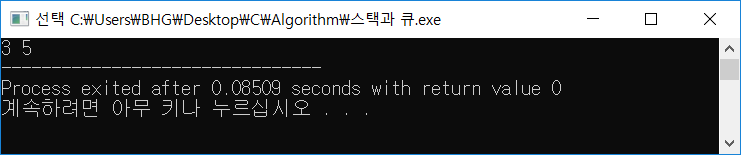

# 스택 (Stack)


말 그대로 쌓아놓은 더미로 `큐(Queue)`와 함께컴퓨터 공학에서 가장 기본이 되는 자료구조
\택배 상하차를 생각하면 된다. 쉽게 말해, 가장 마지막에 들어온 택배가 가장 먼저 나가는 `후입선출(LIFO : Last-In First-Out)` 구조이다.

```C++
#include <iostream>
#include <stack>

using namespace std;

int main(void){
	stack<int> s;
	s.push(5);
	s.push(3);
	s.push(7);
	s.pop();
	s.push(2);
	s.pop();
	while(!s.empty()){
		cout << s.top() << ' ';
		s.pop();
	}
	return 0;
}
```


**STL 라이브러리 <stack>을 사용하여 쉽게 스택을 구현하고 이해할 수 있다.**
- 코드를 보면 5,3,7이 차례대로 들어왔고 s.pop()을 통해 7이 나가게 된다. 다시 2가 들어오고 s.pop()을 통해 7이 나가게 된다.
- 반복문을 통해 가장 위에 있는 값을 출력하게 된다
- 현재 가장 위에 있는 값은 3이므로 3이 먼저 출력되고 s.pop()을 통해 3이 나가게 되며 다시 출력을 하면 5가 출력이 된다.
