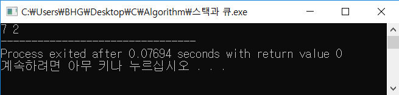

# 큐(Queue)
2019-11-05


큐는 `스택(Stack)`과 함께 대표적인 자료구조로 먼저 들어온 것이 먼저 나가는 `FIFO(First in First Out) 구조` 이다.

- 쉽게 설명하기 위해 예시를 들어보면 은행 창구로  들어보자, **번호표를 먼저 뽑은 사람이 먼저 서비스를 받게 된다.**  중간에 끼어드는 것이 불가능한 것이 기본적인 큐의 구조이다.

```C++
#include <iostream>
#include <queue>

using namespace std;

int main(void){
	queue<int> q;
	q.push(5);
	q.push(3);
	q.push(7);
	q.pop();
	q.push(2);
	q.pop();
	while(!q.empty()){
		cout << q.front() << ' ';
		q.pop();
	}
	return 0;
}
```

- 5,3,7이 차례대로 들어오고 선입선출이므로 pop()을 통해 5가 빠져나간다. 다시 2가 들어오고 pop()을 통해 다시 3이 빠져나간다. 따라서 출력결과가 7 2가 나오게 된다.
