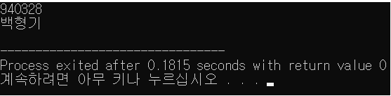
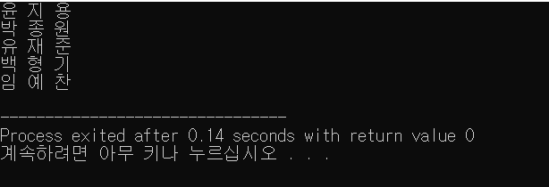

# [STL]  Pair

- 좌표와 같이 쌍을 이루어져 있는 데이터를 표현하고 싶을 때 사용한다.

## 특징
-   <utility> 헤더에 존재한다.
- 두 객체를 하나의 객체로 취급 할 수 있도록 묶어준다.
- pair안에 pair가 들어갈 수 있다.
- first와 second로 첫번째,두번째 자료형에 접근할 수 있다.
- 생성자를 이용할 수 있다. (make_pair)
## 코드 예시

### make_pair를 이용

```c++
#include <iostream>
#include <utility>

using namespace std;

int main(){
	pair<int, string> p1 = make_pair(940328,"백형기");

	cout << p1.first << endl;
	cout << p1.second<< endl;
}
```
- first에는 p1의 첫번째 인자가, second에는 p1의 두번째 인자가 출력된다.


#### 결과 화면



###  vector를 이용한 pair

```c++
#include <iostream>
#include <vector>
#include <utility>
#include <algorithm>

using namespace std;

int main(){
  vector<pair<int,string> > v; // 기본적으로 앞에 int형을 기준으로 sorting 된다.
  v.push_back(pair<int , string>(90, "윤 지 용 "));
  v.push_back(pair<int , string>(93, "백 형 기 "));
  v.push_back(pair<int , string>(92, "유 재 준 "));
  v.push_back(pair<int , string>(94, "임 예 찬 "));
  v.push_back(pair<int , string>(91, "박 종 원 "));  
sort(v.begin(), v.end()); // 첫번째 인자를 기준으로 정렬한다.
for(int i=0; i<v.size(); i++){
  cout<< v.second <<endl;
}
```

#### 결과 화면


- 다음과 같이 성적순으로 오름차순 되어 있는 것을 볼 수 있다.
