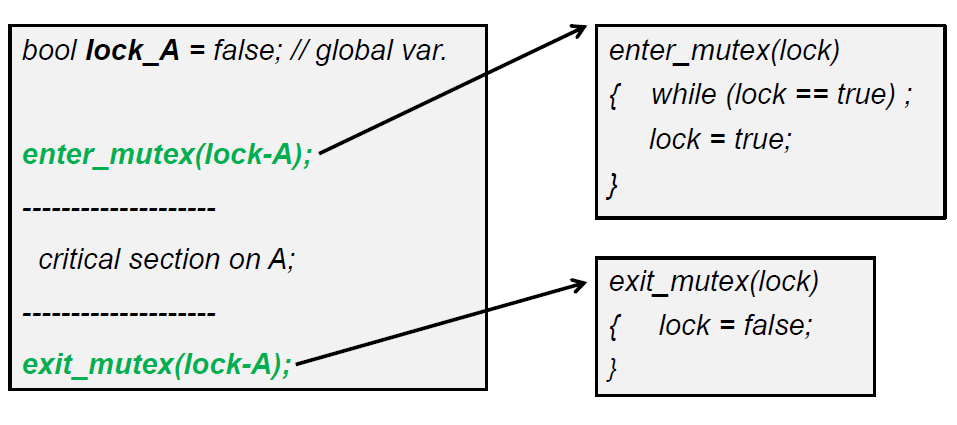
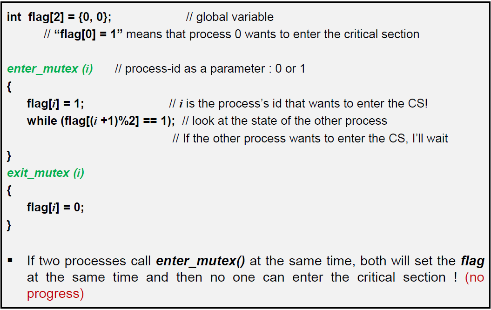
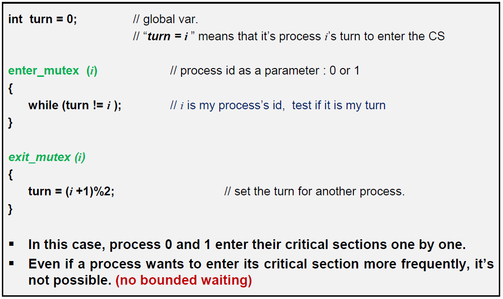

# Critical Section

---
**한번에 한명씩밖에 들어가지 못하는 방이 있다고 생각해보자.**

- `lock == true` : 방이 차있음
- `lock == false` : 방이 비었음

---
## 잘못된 방법

먼저   잘못된 예시부터 확인해보려 한다.

### #1

- `문제점` : lock을 두 사람이 공유를 하므로  lock을 쳐다보고 있다가 **방이 비면 둘이 동시에 들어가버리게 된다.  => Mutual Exclusion X**

### #2
이러한 문제를 해결하기 위해 이번에는 각자 깃발을 가지기로 한다. 상대방이 깃발을 내리면 들어가는 것이다.

-	`while (flag[(i +1)%2] == 1);` : 상대방의 깃발이 내려갈때까지 기다림

- `문제점` : 깃발을 둘 다 계속 올리고 있으면 그 누구도 들어가지 못하므로 **더 이상 진행(Progress)이 되지 않는다.**

### #3
 `#2` 에서는 둘 모두 들어가지 않는 문제가 발생하므로 차례(turn)를 정해주어 방에 들어가게 해준다.

- `turn` : 자신의 차례가 되면 방에 들어간다.
- 자신의 차례가 끝나면 turn을 다음 사람에게 넘겨준다.
- `문제점` : 방에 많이 들어가야 하는 사람과 적게 들어가야하는 사람간의 차이가 없게된다. 많이 들어가야 하는 사람의 경우 기다림는 시간이 매우 길어질 것이다. **즉, Mutual Exclusion은 되지만 bounded waiting이 되지 않는다.**
----
##Peterson's Algorithm

- 깃발 드는 것과 turn을 같이 사용
