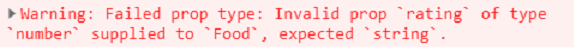

#propTypes
부모 컴포넌트에서 자식 컴포넌트로 props를 전달 받을 때 우리가 원하는 props이 우리가 갖고 있는 props인지 체크하는 방법이 필요하고 `propTypes`가 필요한 이유이다.

다음 코드를 보자.
```javascript
const foodILike = [
  {
    id:1,
    name: "Kimchi" ,
    desc: "Traditional food",
    rating : 5.0

  },
  {
    id:2,
    name: "Kimbap" ,
    desc: "Traditional food",
    rating : 4.0
  },
  {
    id:3,
    name: "samgyupsal" ,
    desc: "Traditional food",
    rating : 4.1
  }
]

function Food({name , desc , rating}){
  return (
    <div>
    <h1>{name}</h1>
    <h2>{desc}</h2>
    <h4>{rating}</h4>
    </div>
  );
}

Food.propTypes={
  name: propTypes.string.isRequired,
  desc: propTypes.string.isRequired,
  rating: propTypes.string.isRequired
}
```
----

다음과 같이 rating의 `propTypes`를 `string`으로 해놨지만   rating은 `number`로 설정 되어있으므로 경고창이 뜬다.

**다시 말해  자식 컴포넌트에 다른 변수를 보내거나, 다른 자료형을 쓰는 것을 propTypes를 통해 방지할 수 있다.**
