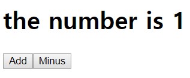
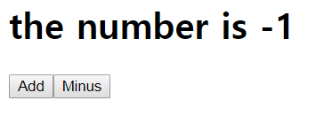

# setState
react에서 state의 상태를 바꾸고 싶을 때 사용하는 메소드이다.
setState를 사용하지 않는다면 react는 state를 refresh하지 못하여 바뀐 state를 보여주지 못한다.
따라서 setState를 이용하여 state를 refresh하고 render function을 호출한다.

## 간단예제
```javascript
import React from 'react';

class App extends React.Component {
  state = {
    count: 0
  };
  add = () => {
    this.setState({count: 1});
  };

  minus = () =>{
    this.setState({count: -1});
  };

  render() {
    return (
      <div>
        <h1>the number is {this.state.count}</h1>
        <button onClick={this.add}>Add</button>
        <button onClick= {this.minus}>Minus</button>
      </div>
    );
  }
}
```


Add 버튼을 누르면 count는 1로 바뀐다.


minus 버튼을 누르면 count는 -1로 바뀐다.
